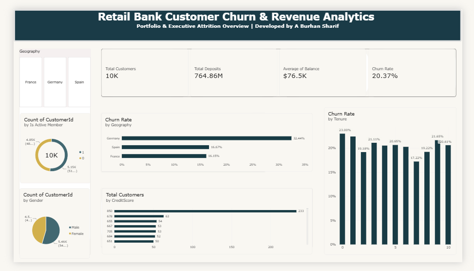

# Retail Bank Customer Churn & Revenue Analytics

An executive-level Power BI analytics solution developed to track customer churn drivers, analyze financial risk distributions, and monitor deposit metrics across 10,000+ retail banking accounts.

## Technical Pipeline
* **SQL (`Bankpro01.sql`):** Data aggregation, customer retention segmentation, and cohort analytics.
* **Excel:** Initial data prep, field structural checks, and formatting verification.
* **Power BI & DAX:** Data modeling, custom measures (Churn Rate %, Deposits), dynamic page cross-filtering, and visual presentation.

## Key Business Insights
* **Geographic Risk:** Germany exhibits a **32.44% churn rate**, significantly higher than France (16.15%) and Spain (16.67%).
* **Revenue Impact:** Total portfolio churn stands at **20.37%**, affecting **$764.86M in total deposits**.
* **Demographic Segmentation:** Inactive accounts and specific credit score brackets represent the highest concentration of lost retention.
